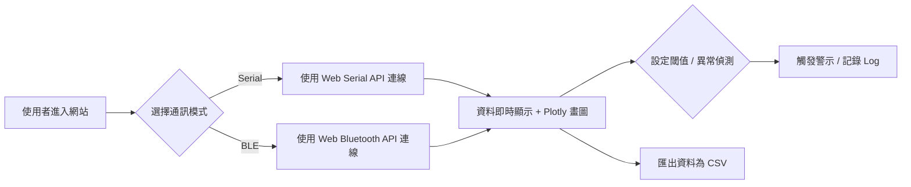

## 網頁程式設計專題──Web Data Plotter

### 
* #### [期末Demo簡報](https://www.canva.com/design/DAGmxfrgJHc/x9D9v0q6Aoam7t9tDin14w/view?utm_content=DAGmxfrgJHc&utm_campaign=designshare&utm_medium=link2&utm_source=uniquelinks&utlId=h8a94bbe6b0)
* #### [網頁連結](https://tonywu115.github.io/web-design-project/)

### 網頁功能
* 讀取串口、藍芽數據
* 即時顯示數據
* 繪製成波型
* 顯示數據最大最小值、平均值
* 設定警示值
* 偵測數據突變
* 將數據輸出成CSV檔

### 接收數據方式
* Serial
* BLE 4.0

### 注意事項
- 若使用`serial plotter`，則需使用支援 [Web Serial API](https://developer.mozilla.org/en-US/docs/Web/API/Web_Serial_API) 的瀏覽器
    - Chrome
    - Edge
- 單晶片 Buad Rate 要設定成`9600`,`19200`,`38400`,`57600`,`115200`其中一個
- 數據格式 `"%.f\r\n"`
    ```C
    sprintf((char*)uart_buffer, "%.f\r\n", value);
    ```

#
### 流程圖如下

---
## Demo
* serial data plotter


* BLE data plotter


* Alert


---
```
                       _ooOoo
                      o8888888o
                      88" . "88 
                      (| -_- |)
                      O\  =  /O
                    ___/`---'\____
                 .'  \\|     |//  `.
                /  \\|||  :  |||//  \
                /  _||||| -:- |||||_  \
                |   | \\\  -  /// |   |
                | \_|  ''\---/''  |   |
                \  .-\__       __/-.  /
                ___`. .'  /--.--\ `. . __
            ."" '<  `.___\_<|>_/__.'  >'"".
            | | :  `- \`.;`\ _ /`;.`/ - ` : | |
            \  \ `-.   \_ __\ /__ _/   .-` /  /
    ======`-.____`-.___\_____/___.-`____.-'======
                        `=---='
^^^^^^^^^^^^^^^^^^^^^^^^^^^^^^^^^^^^^^^^^^^^^^^^^^^^^^
                 佛祖保佑       永無BUG
```