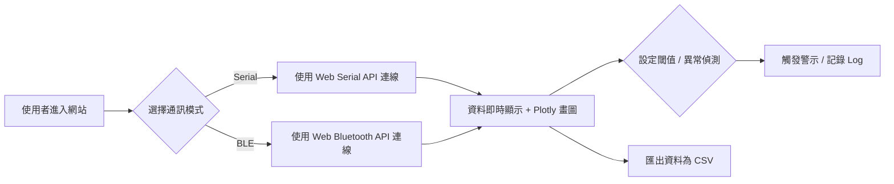

```mermaid
graph LR
A[使用者進入網站] --> B{選擇通訊模式}
B -->|Serial| C[使用 Web Serial API 連線]
B -->|BLE| D[使用 Web Bluetooth API 連線]
C --> E[資料即時顯示 + Plotly 畫圖]
D --> E
E --> F{設定閾值 / 異常偵測}
F --> G[觸發警示 / 記錄 Log]
E --> H[匯出資料為 CSV]
```